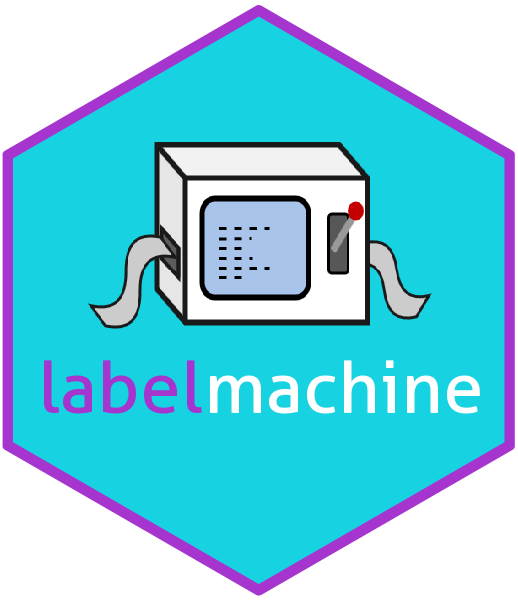

---
output:
  github_document:
    html_preview: false
---
# labelmachine 

<!-- badges: start -->
[](https://travis-ci.org/a-maldet/labelmachine)

[](https://github.com/a-maldet/labelmachine/commits/master)

[](https://github.com/a-maldet/labelmachine)

[](https://codecov.io/github/a-maldet/labelmachine?branch=master)

[](https://www.r-pkg.org/badges/version-last-release/labelmachine)

<!-- badges: end -->

`labelmachine` is an **R** package that helps assigning meaningful
labels to data sets.
Furthermore, you can manage your labels
in so called **lama-dictionary** files, which are **yaml** files.
This makes it very easy using the same label translations in multiple
projects which share similar data structure.

> Labelling your data can be easy!

## Installation

```{r, eval = FALSE}
# Install development version from GitHub
devtools::install_github('a-maldet/labelmachine', build_opts = NULL)
```

## Concept

The label assignments are given in so called **translations** (named character vectors),
which are like a recipes, telling which original value will be mapped onto which new label.
The **translations** are collected in so called **lama_dictionary** objects.
This **lama_dictionary** objects will be used to translate your data.frame variables.

## Usage

Let **df** be a data.frame with marks and subjects, which should be translated
```{r}
df <- data.frame(
  pupil_id = c(1, 1, 2, 2, 3),
  subject = c("en", "ma", "ma", "en", "en"),
  result = c(2, 1, 3, 2, NA),
  stringsAsFactors = FALSE
)
df
```

Create a **lama_dictionary** object holding the translations:
```{r}
library(labelmachine)
dict <- new_lama_dictionary(
  subjects = c(en = "English", ma = "Mathematics", NA_ = "other subjects"),
  results = c("1" = "Excellent", "2" = "Satisfying", "3" = "Failed", NA_ = "Missed")
)
dict
```

Translate the data.frame variables:
```{r}
df_new <- lama_translate(
  df,
  dict,
  subject_new = subjects(subject),
  result_new = results(result)
)
str(df_new)
```

## Highlights

`labelmachine` offers the following features:

* All types of variables can be translated: **Logical**, **Numeric**, **Character**, **Factor**
* When translating your varaibles, you may choose between keeping the current ordering or applying a new factor ordering to your variable.
* Assigning meaningful labels to missing values (**NA**) is no problem.
* Assigning **NA** to existing values is no problem.
* Merging two values into a single label is no problem.
* Transforming **data.frame** holding label assignment lists into a **lama_dictionary** is no problem.
* Manage your translations in **yaml** files in order to use the same translations
  in different projects sharing similare data.

## Further reading

A short introduction can be found here: [Get started] 

[Get started]: https://a-maldet.github.io/labelmachine/articles/labelmachine.html

