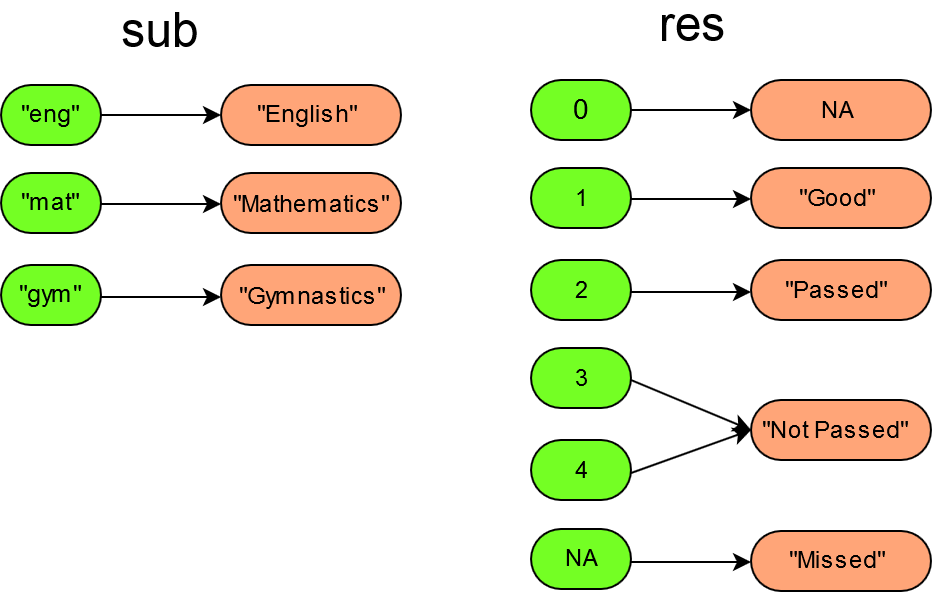

```{r, include = FALSE}
knitr::opts_chunk$set(
  echo = TRUE,
  message = FALSE,
  warning = FALSE,
  collapse = TRUE,
  comment = "#>"
)
knitr::opts_hooks$set(out.maxwidth = function(options) {
  if (!knitr:::is_html_output())
    return(options)
  options$out.extra <- sprintf('style="max-width: %s;"', options$out.maxwidth)
  options
})
```

As already described in [Get started] we need **translations**, which tell
us how the labels should be assigned to the different values of a variable.
These translations are collected in a **lama-dictionary** object.
With the `labelmachine` package, translations can be written as
named character vectors:
```{r}
subject_translation <- c(eng = "English", mat = "Mathematics", gym = "Gymnastics")
```
The names of the character vector items correspond to the original values
(e.g.: `"eng"`, `"mat"` and `"gym"`) and the item values correspond to the
new labels which should be used (e.g.: `"English"`, `"Mathematics"` and `"Gymnastics"`).

Lama-Dictionaries always assume that the original variables are of type
**character**. Even if they are not, it does not make a difference, since
when calling `lama_translate()` the original variables of different types
(**logical**, **numeric** or **factor**) will automatically be transformed
into **character** variables. Hence, `labelmachine` can handle any type of
variables.

## From scratch

With the command `new_lama_dictionary()` a lama-dictionary can be created
on the fly:

```{r}
library(labelmachine)
dict <- new_lama_dictionary(
  sub = subject_translation,
  res = c(
    "1" = "Good",
    "2" = "Passed",
    "3" = "Not passed",
    "4" = "Not passed",
    NA_ = "Missed",
    "0" = NA
  )
)
dict
```

Each named argument in `new_lama_dictionary()` defines a translation. The
passed in argument names are used as translation names
(e.g. `"sub"` and `"res"`).
The first translation `sub` was given by a named character vector, holding 
the full length labels for the subjects of a data set holding encoded subject
values (e.g. `"eng"` for `"English"`, `"mat"` for `"Mathematics"` and `"gym"`
for `"gymnastics"`).
The second translation `res` holds the full length labels for the encoded test results.
In translation `res` multiple values were mapped onto a single label string 
(e.g. `3` and `4` were mapped onto `"Not passed"`).
The expression `NA_` in translation `res` is used to escape the
missing value symbol `NA` (only necessary in the name fields of the translation
vectors).
Hence, the last assignment `NA_ = "Missed"` defines that missing values
should be labeled with the string `"Missed"`.
The last expression `"0" = NA` given in translation `res` tells that
all zero values `0` should be mapped onto the missing value symbol `NA`.

```{r, out.maxwidth = "450px"}

```


## From a list object holding translations

If we have a named list object holding translations (named character vectors),
then we can turn it into a lama-dictionary object with the command `new_lama_dictionary()`:

```{r}
obj <- list(
  sub = c(eng = "English", mat = "Mathematics", gym = "Gymnastics"),
  res = c(
    "1" = "Good",
    "2" = "Passed",
    "3" = "Not passed",
    "4" = "Not passed",
    NA_ = "Missed",
    "0" = NA
  )
)
dict <- new_lama_dictionary(obj)
dict
```


## From an existing **yaml** file

As described in [Get started] lama-dictionaries can be saved to **yaml** files.
These files are plain text files with a specific structure. 
For example the file `dictionary.yaml` may looks as follows
```{yaml, code = readLines(system.file("extdata", "dictionary_exams.yaml", package = "labelmachine"))}
```
On the top level (no indentation) there are the translation names followed by a
colon
(e.g. `sub:`, `res:` and `lev:`)
the following lines describe the label assignment rules of the translation
(indentation of two whitespaces `  `).
Each line contains a single label assignment, where the original value comes
first (use quotes in case of a numeric or logical, e.g. `'1': "Very good"`), 
followed by a colon and then comes the label, which should be assigned to the 
value.
The file shown above contains the following translations:

* translation `sub`, which assigns
  * the label `"English"` to the value `eng`
  * the label `"Mathematics"` to the value `mat`
  * the label `"Gymnastics"` to the value `gym`
* translation `res`, which assigns
  * the label `"Good"` to the value `1`
  * the label `"Passed"` to the value `2`
  * the label `"Not passed"` to the values `3` and `4`
  * the label `"Missed"` to the missing value `NA`
  * the missing value `NA` to the value `0`
* translation `lev`, which assigns
  * the label `"Basic"` to the value `"b"`
  * the label `"Advanced"` to the value `"a"`

With the command `lama_read()` a lama-dictionary can be loaded:
```{r, eval = FALSE}
path_to_file <- system.file("extdata", "dictionary_exams.yaml", package = "labelmachine")
dict <- lama_read(path_to_file)
```

With the command `lama_write()` the lama-dictionary `dict` can be saved as a
**yaml** file:
```{r, eval = FALSE}
path_to_file <- file.path(tempdir(), "my_dictionary.yaml")
lama_write(dict, path_to_file)
```

## From already existing label assignment rules

Sometimes, there are already **csv** or **excel** files or **data frames**
holding label assignment rules. Normally this assignment rules are stored
as column pairs, where one column always represents the original values and
the other column holds the corresponding label strings.
In case of the assignments are stored in a **csv** or an **excel** file, they
can be loaded into a data frame with the commands
`read.csv()` or `read.table()`. Hence, it is sufficient to cover the case
of label assignment rules given as data frames.

Let `df_trans` be a data frame holding the label assignment rules:
```{r, include = FALSE}
df_trans <- data.frame(
  sub_old = c("eng", "mat", "gym", NA, NA, NA),
  sub_new = c("English", "Mathematics", "Gymnastics", NA, NA, NA),
  res_old = c(0, 1, 2, 3, 4, NA),
  res_new = c(NA, "Good", "Passed", "Not passed", "Not passed", "Missed")
)
```
```{r}
df_trans
```

The command `as.lama_dictionary` reads in the label assignment rules given in
`df_trans` and returns a lama-dictionary object holding the given translations:
```{r}
dict <- as.lama_dictionary(
  .data = df_trans,
  translation = c("sub", "res"),
  col_old = c("sub_old", "res_old"),
  col_new = c("sub_new", "res_new")
)
dict
```
The resulting lama-dictionary `dict` contains two translations `sub` and `res`.

The command `as.lama_dictionary()` also allows an argument `ordering`, which
specifies how the ordering of the translations should
be determined. For further details, see `as.lama_dictionary()`.

## Further reading

* [Translating variables]
* [Altering lama-dictionaries]
* [Get started]

[Get started]: https://a-maldet.github.io/labelmachine/articles/labelmachine.html
[Creating lama-dictionaries]: https://a-maldet.github.io/labelmachine/articles/create_dictionaries.html
[Altering lama-dictionaries]: https://a-maldet.github.io/labelmachine/articles/alter_dictionaries.html
[Translating variables]: https://a-maldet.github.io/labelmachine/articles/translate.html

